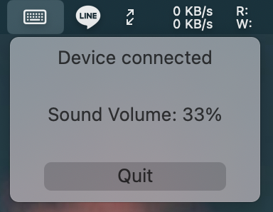

# ZMK Companion

A main menu macOS application communicate to ZMK powered HID device.

## (Only One) Feature:
- Synchronize master sound volume level to a [motorized fader](https://tech.alpsalpine.com/e/products/detail/RS60N11M9A0F/). Please checkout [this](https://github.com/badjeff/zmk-config/blob/0f1ed1f050bbced22127284eb78e1b7e48da5f47/config/boards/shields/zero36/zero36.keymap#L162) zmk-config repo for details if you are interested.

- 🎬 WIP Video at [https://imgur.com/a/DuWsinB](https://imgur.com/a/DuWsinB)
