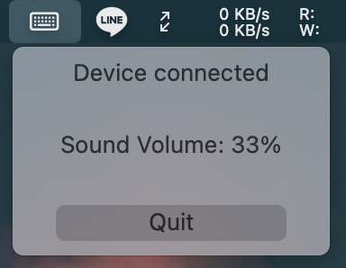

# ZMK Companion

A main menu macOS application communicate to ZMK powered HID device.



## Features:
- Synchronize master sound volume level to a [motorized fader](https://tech.alpsalpine.com/e/products/detail/RS60N11M9A0F/). Please checkout [this](https://github.com/badjeff/zmk-config/blob/0f1ed1f050bbced22127284eb78e1b7e48da5f47/config/boards/shields/zero36/zero36.keymap#L162) zmk-config repo for details if you are interested. 🎬 WIP Video at [https://imgur.com/a/DuWsinB](https://imgur.com/a/DuWsinB)

- Highlight main menu icon as host-side layer indicator via hot keys [F18/F19/F20], which could be triggered by [zmk-output-behavior-listener](https://github.com/badjeff/zmk-output-behavior-listener) with ZMK config on below.


```dts
/* keymap layers */
#define DEF 0 // base layer
#define MSK 1 // mouse-key layer
#define MSC 2 // mouse-scroll layer, which tells `input-processor` transform trackball input to scroll wheel

/* setup zmk,output-behavior-listener to trigger function key F18 / F19 / F20 on layer state change */
#define OUTPUT_SOURCE_LAYER_STATE_CHANGE        1
/{
        kp_f19_on_enter_mmv_layer {
                compatible = "zmk,output-behavior-listener";
                sources = < OUTPUT_SOURCE_LAYER_STATE_CHANGE >;
                layers = < MSK >;
                bindings = < &kp F19 >; tap-ms = <30>;
        };
        kp_f20_on_enter_msc_layer {
                compatible = "zmk,output-behavior-listener";
                sources = < OUTPUT_SOURCE_LAYER_STATE_CHANGE >;
                layers = < MSC >;
                bindings = < &kp F20 >; tap-ms = <30>;
        };
        kp_f19_on_leave_msc_to_mmv_layer {
                compatible = "zmk,output-behavior-listener";
                sources = < OUTPUT_SOURCE_LAYER_STATE_CHANGE >;
                invert-state; position = < MSC >; layers = < MSK >; 
                bindings = < &kp F19 >; tap-ms = <30>;
        };
        kp_f18_on_leave_mmv_to_def_layer {
                compatible = "zmk,output-behavior-listener";
                sources = < OUTPUT_SOURCE_LAYER_STATE_CHANGE >;
                invert-state; position = < MSK >; layers = < DEF >; 
                bindings = < &kp F18 >; tap-ms = <30>;
        };
        kp_f18_on_leave_msc_to_def_layer {
                compatible = "zmk,output-behavior-listener";
                sources = < OUTPUT_SOURCE_LAYER_STATE_CHANGE >;
                invert-state; position = < MSC >; layers = < DEF >; 
                bindings = < &kp F18 >; tap-ms = <30>;
        };
};
```